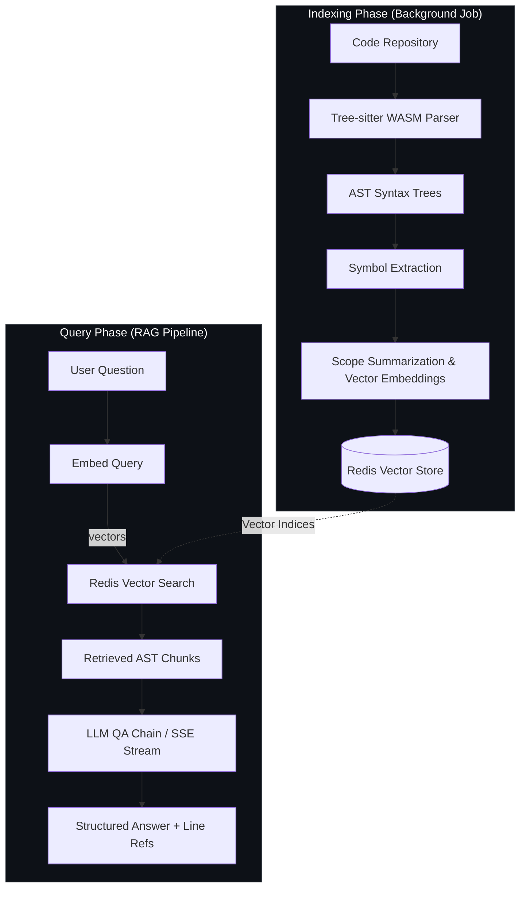
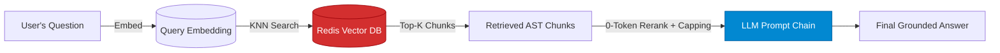

# ΛRCHON — Autonomous AI Codebase Intelligence & Graph RAG Engine

[](https://www.typescriptlang.org/)
[](https://nextjs.org/)
[](https://expressjs.com/)
[](https://redis.io/)
[](https://www.mongodb.com/)
[](https://tree-sitter.github.io/tree-sitter/)

**Archon** is an enterprise-grade AI codebase intelligence platform that parses code ASTs (Abstract Syntax Trees), indexes symbol structures into a Redis Vector Store, and executes 0-token hybrid reranking RAG to provide instantaneous code generation, architectural visualization, technical debt assessments, and context-aware codebase QA.

---

## 📐 Architecture & System Flow

Archon employs a high-performance **dual-pipeline design** for repository indexing and vector-augmented retrieval.

### 1. Dual Indexing & Query Architecture



---

### 2. KNN Vector Search & Generation Pipeline



---

## 🚀 Getting Started & Setup Guide

### 1. Prerequisites

Ensure you have the following installed on your local environment:
- **Node.js**: `v18.x` or higher
- **MongoDB**: Local server (`mongodb://127.0.0.1:27017/archon`) or MongoDB Atlas cluster URI
- **Redis**: Redis Stack / Redis Cloud with Vector Search support enabled

---

### 2. Configuring Credentials ("Using Your Own API Key")

Archon is designed to be **API-key agnostic** with automated engine fallback logic. You can use your own API keys from **Groq**, **OpenAI**, or **Anthropic**.

#### Backend Configuration (`backend/.env`):
Create a `.env` file inside the `backend` folder:

```env
PORT=5000
MONGODB_URI=mongodb://127.0.0.1:27017/archon
REDIS_URI=redis://127.0.0.1:6379

# --- AI Engine Credentials (Bring Your Own API Keys) ---
# Primary Engine (Ultra-fast, Llama-3.3-70b-versatile)
GROQ_API_KEY=your_groq_api_key_here

# Fallback / Alternative Engine (GPT-4o-mini & Embeddings)
OPENAI_API_KEY=your_openai_api_key_here

# Optional Fallback Engine (Claude-3.5-Sonnet)
ANTHROPIC_API_KEY=your_anthropic_api_key_here

# Optional GitHub PAT (Bypasses GitHub API rate limits for private repos)
GITHUB_PAT=your_github_personal_access_token
```

> [!TIP]
> **API Key Flexibility & Priority:**
> - **Default Primary Engine:** Groq (`llama-3.3-70b-versatile`) handles high-speed agent analysis and streaming QA.
> - **Single Key Operation:** If you only have an **OpenAI API Key**, Archon will automatically fall back to OpenAI (`gpt-4o-mini` & `text-embedding-3-small`) to run all agents, embeddings, and chat QA seamlessly!
> - **Zero-Key Mode (Mock Fallback):** If no LLM keys are supplied, Archon runs local AST parsing, dependency graph extraction, and structural metric analysis in deterministic fallback mode.

#### Frontend Configuration (`archon/.env.local`):
Create a `.env.local` file inside the `archon` directory:

```env
NEXT_PUBLIC_API_URL=http://localhost:5000
```

---

### 3. Installation & Local Execution

#### Step 1: Start Backend API & Indexer
```bash
cd backend
npm install
npm run dev
```
*The Express server runs on `http://localhost:5000`.*

#### Step 2: Start Archon Web Application
```bash
cd archon
npm install
npm run dev
```
*Open [http://localhost:3000](http://localhost:3000) in your browser.*

---

## ⚡ How To Use Archon

1. **Authentication**: Register a new account or log in. User sessions, token quotas, and repository settings are secured via JWT authentication.
2. **Submit Repository URL**: Paste any public or private GitHub repository URL (e.g., `https://github.com/facebook/react`).
3. **Automated Indexing Pipeline**:
   - **Git Clone & AST Parsing**: Parses source files into 9 symbol types (`function`, `class`, `component`, `hook`, `method`, `interface`, `enum`, `type_alias`, `exported_const`).
   - **SHA-256 State Diffing**: Computes file hashes to perform incremental index updates.
   - **Redis Embedding**: Embeds AST chunks into the vector store for semantic search.
4. **Explore Codebase Intelligence**:
   - **Interactive Dependency Graph**: Visualize dynamic import relationships with React Flow node clustering.
   - **Onboarding Guide & Timeline**: Step-by-step developer setup and system architecture walkthroughs.
   - **Technical Debt Assessor**: Auto-identify complex refactoring hotspots (Cyclomatic Complexity > 10).
   - **Security Audits & PR Trackers**: Real-time evaluation of structural risks.
5. **Chat with Codebase**: Ask natural language questions (e.g., *"How does user authentication token verification work in this codebase?"*). Archon streams grounded answers token-by-token with exact file line references.

---

## 📊 Performance, Tradeoffs & Repository Scaling Analysis

### Repository Size vs. Processing Time

As repositories grow in file size and line count, indexing time scales proportionately due to tree parsing, SHA-256 state hashing, and dense vector generation.

| Repository Size | File Count | Lines of Code (LOC) | Indexing & Parsing Time | Vector Search Latency | Token Usage per Query |
| :--- | :--- | :--- | :--- | :--- | :--- |
| **Small** | < 50 files | < 5,000 LOC | **1.0s – 2.5s** | **< 5 ms** | ~1,200 – 1,500 tokens |
| **Medium** | 50 – 200 files | 15,000 – 50,000 LOC | **5.0s – 15.0s** | **< 10 ms** | ~1,500 – 2,000 tokens |
| **Large** | 200 – 1,000+ files | 50,000 – 500,000+ LOC | **30.0s – 3.0 mins** | **15 ms – 35 ms** | ~1,500 – 2,300 tokens |

---

### ⏱️ Why Larger Repositories Take Longer

1. **Tree-sitter WASM AST Parsing Overhead**:
   Unlike plain-text regex matchers, Archon constructs full Concrete Syntax Trees (CSTs) across JavaScript, TypeScript, Python, and Go files. Extracting recursive code blocks (`if`, `switch`, `try` statements) guarantees 100% syntactically intact symbols but increases CPU processing time on repositories with thousands of files.
2. **Dense Vector Embedding Batching**:
   Every extracted symbol chunk is converted into high-dimensional vector embeddings (`384-dim` / `1536-dim`). Processing thousands of chunks requires batch network transfers or local transformer compute.
3. **SHA-256 State Diffing & Git Log Traversal**:
   Archon scans historical commit logs to build architectural evolution milestones. On large repos with deep commit trees, git child-process extraction adds parsing overhead.

---

### ⚖️ Technical Tradeoffs Made in Archon

| Architectural Decision | Cost / Overhead | Benefit / Measurable Result |
| :--- | :--- | :--- |
| **1. AST Symbol Chunking vs. Character Splitting** | Initial parsing adds **~800ms** processing time vs raw text slicing (**~100ms**). | **Zero mid-statement code cuts** and **zero LLM hallucinations**. Every chunk retains full scope headers (`// Scope: AuthController.login`). |
| **2. SHA-256 Incremental Indexing** | Requires maintaining a file state registry in MongoDB. | **~75% reduction in re-indexing duration** on subsequent commits by re-embedding only modified files (`Misses`). Unchanged files (`Hits`) are skipped. |
| **3. Context Capping (Top-4 AST Chunks / ~1.5k Tokens)** | Limits raw context payload size sent to the LLM. | **>85% reduction in token usage** (17,500 → 1,500 tokens per query). Eliminates Groq/OpenAI HTTP 429 rate limit crashes. |
| **4. 0-Token Deterministic Hybrid Reranker** | In-memory composite score calculation combining vector distance, path depth, and AST keywords. | Executes in **<2ms on local CPU** with **0 extra LLM token cost** (compared to expensive, high-latency LLM reranking calls). |
| **5. Dual Database Setup (Redis + MongoDB)** | Requires managing two persistent data stores (Redis Vector DB + MongoDB). | Redis handles **<5ms KNN vector similarity search**, while MongoDB stores schema-flexible user auth, token logs, commit trees, and agent reports. |

---

## 🛠️ Verification & Testing

To verify backend type safety and frontend builds:

```bash
# Verify backend compilation
cd backend
npm run build

# Verify frontend Next.js production build
cd archon
npm run build
```

---

## 📜 License

Distributed under the MIT License. See `LICENSE` for details.
